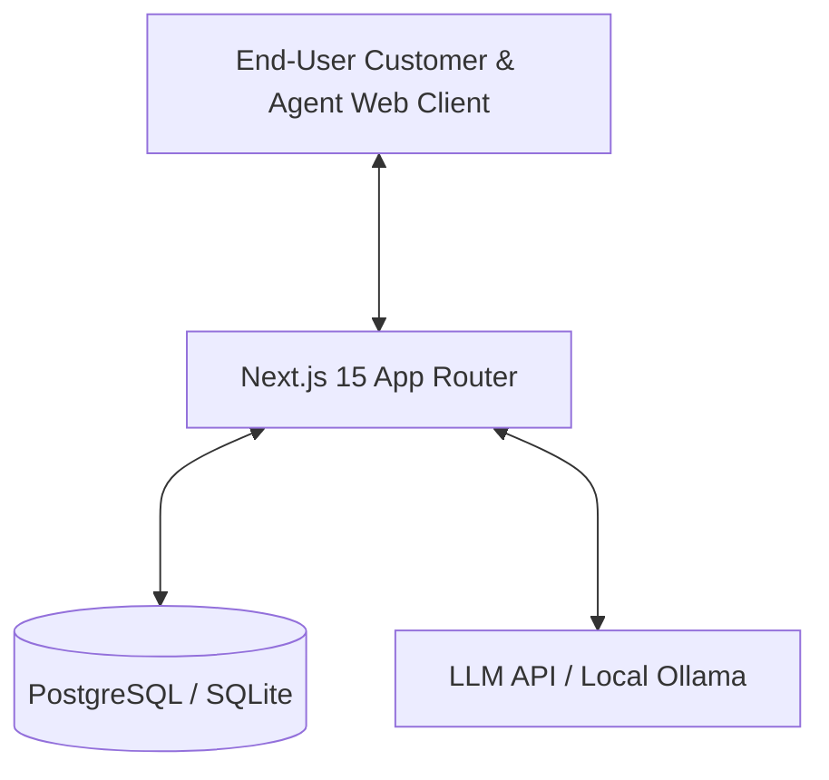

# System Architecture

This document describes the target architecture for the migrated Bioniq Chat Pro application. The application will be rebuilt as a fully independent, standalone web application, replacing all Taskade platform dependencies with a proper local/self-hosted stack.

## Architecture Diagram

## Core Components

1. **Customer Web Portal**: A web-based, standalone application featuring the WhatsApp-like messaging experience.
2. **Agent / Admin Portal**: A secure dashboard for internal agents/managers to manage conversations, support tickets, installations, orders, and customer databases.
3. **Database (Prisma + PostgreSQL/SQLite)**: Proper relational representation of Taskade projects.
4. **AI Orchestration (Vercel AI SDK or Custom Orchestration)**: Handles LLM interaction, RAG / agent knowledge searches, and tool calling for ticket/order/appointment updates.

## Relational Database Schema Mapping

- **Customers**: Mapped from `EdTX81Qs3i4JwPxs.json` (phone, email, status, plan, address, monthlyFee, language).
- **Products**: Mapped from `HPpKWYiSMBbn6Ta8.json` (sku, name, price, availability, stock, description).
- **Orders**: Mapped from `ZGP7PY6VQiAhvEpK.json` (items, customer details, amount, status, tracking, payment).
- **Appointments**: Mapped from `S9ZKbhB6t7DYcjFt.json` (technician, customer details, address, status, timeslot).
- **Tickets**: Mapped from `NTEpfNJa25HGekRL.json` (status, priority, category, resolutionTime).
- **Threads / Messages**: Mapped from `FEEux561JsGo2G6G.json` (message history, sender, timestamps, status).
