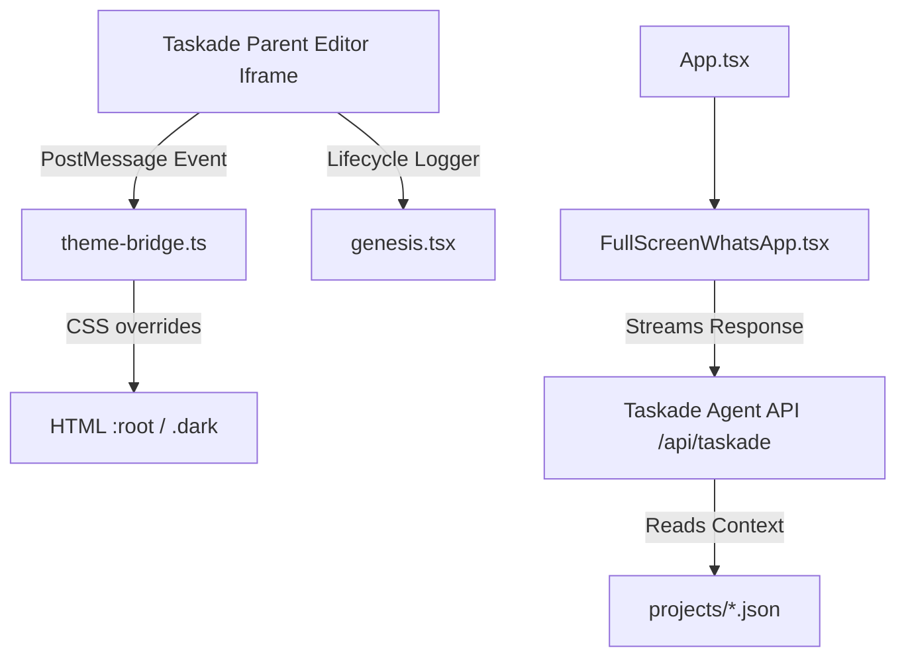

# System Architecture & Key Flows

This document details the system design of Bioniq Chat Pro and the communication protocols between components.

## Architecture Topology

## Core Modules

### 1. The Iframe Theme Bridge ([`theme-bridge.ts`](file:///C:/Users/verac/OneDrive - Salaria/Github_All/AN3S-CREATE/bioniq-chat-pro/apps/default/src/lib/theme-bridge.ts))
Listens for message broadcasts from the parent window. It supports two message types:
*   `TASKADE_THEME_UPDATE`: Extracts CSS HSL custom property configurations and applies them dynamically to `:root` (for light mode) and `.dark` (deriving appropriate dark-mode values).
*   `TASKADE_THEME_READ`: Reads computed style properties from the document root and sends them back to the parent frame via `postMessage`.

### 2. Error Boundary Wrapper ([`genesis.tsx`](file:///C:/Users/verac/OneDrive - Salaria/Github_All/AN3S-CREATE/bioniq-chat-pro/apps/default/src/lib/genesis.tsx))
Wraps the application in a custom React ErrorBoundary.
*   **Preview Mode**: If `window.__TASKADE_APP_LIFECYCLE_LOGGER__` is detected, it logs uncaught errors and triggers a "Fix with AI" dialog inside Taskade.
*   **Production/Published Mode**: It suppresses the raw stack trace and shows a clean, user-friendly error fallback for end customers.

### 3. API Integration ([`FullScreenWhatsApp.tsx`](file:///C:/Users/verac/OneDrive - Salaria/Github_All/AN3S-CREATE/bioniq-chat-pro/apps/default/src/components/FullScreenWhatsApp.tsx))
Communicates with the Taskade public conversations endpoint.
*   **Session Start**: Sends a POST request to `/api/taskade/agents/:agentId/public-conversations` to obtain a `conversationId`.
*   **Chat Completion**: Submits messages to `/api/taskade/agents/:agentId/public-conversations/:convoId/chat` alongside the conversation history. It parses standard server-sent events:
    *   `data: {"type": "text-delta", "delta": "..."}`: Real-time response streaming.
    *   `data: {"type": "finish"}`: Terminating standard events.
