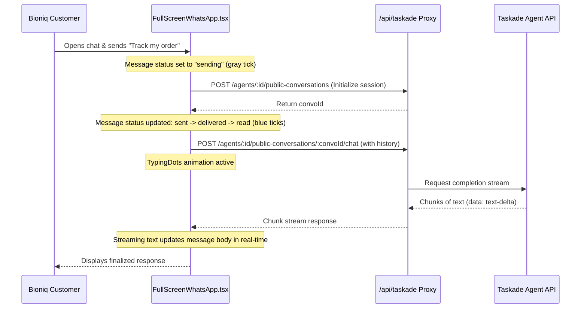

# ProjectIntel: Comprehensive Project Report
## Workspace: Bioniq Chat Pro

---

### Executive Summary

**Bioniq Chat Pro** is an AI-powered conversational interface designed to emulate WhatsApp Business, tailored specifically for **Bioniq**, an Internet Service Provider (ISP) operating in Steve Tshwete, Mpumalanga, South Africa. It serves as a custom micro-app preview template built on the Taskade Parade agent platform. 

*   **Maturity Level**: **Prototype / Preview Template**. The project contains a fully operational WhatsApp UI simulation that connects to the Taskade public conversations API, alongside a substantial suite of legacy/alternative views that are currently bypassed.
*   **Top 3 Strengths**:
    1.  **High-Fidelity WhatsApp Business Simulation**: Pixel-perfect replication of WhatsApp's chat interface, bubble tails, typing indicator, status indicators, and messaging lifecycle.
    2.  **Native Taskade Integration**: Seamless integration with the Taskade Parade agent API for real-time text streaming, session management, and editor theme overrides.
    3.  **Extensive Feature Reference**: Contains structured code demonstrating admin capabilities, customer billing views, and product inventories.
*   **Top 3 Risks / Opportunities**:
    1.  **Broken Local Build/Dev Pipelines**: (P0) Crucial build scripts (`scripts/build.mjs`) are missing, preventing out-of-the-box local compilation or testing.
    2.  **Agent Domain & Copy Mismatch**: (P1) The active Taskade Agent description claims to be for a "solar panel installation business" while all underlying project data and UI copy are for a fiber ISP.
    3.  **Dead Code Accumulation**: (P2) Over 75% of UI components are bypassed as `App.tsx` directly mounts `FullScreenWhatsApp.tsx`. These components represent technical debt.

---

### Project Overview & Business Purpose

The system is a customer-facing support application for **Bioniq**, a South African regional ISP. It enables Bioniq customers to interact with an AI support agent through a WhatsApp-like messaging experience. 

Based on project databases found in `projects/`, the agent helps customers:
*   Inquire about internet packages (e.g., *Unrestricted Uncapped 100Mbps*).
*   Track order shipments (e.g., *WiFi 6 Router Upgrade*).
*   Schedule fiber installation appointments.
*   Resolve support tickets.

---

### What the Project Does

The core capability is a **Real-Time WhatsApp Chat Interface** that connects to a Taskade AI Agent (`01K8BSAKNHPDZHBSZ3RV4DK9E9`).

Key features of this interface include:
*   **Encrypted Notice & Quick Replies**: Mimics WhatsApp’s encryption notices and offers buttons like "Check my internet speed", "Track my order", or "Speak to human agent" to jump-start conversation flows.
*   **Realistic Status & Typing Dots**: Animates typing states and shows the agent as "online" with a green indicator.
*   **Response Streaming**: Streams answers chunk-by-chunk using EventSource/Fetch API chunk reading for low perceived latency.
*   **End-to-End Delivery States**: Shows ticks for sending (`sending`), sent (`sent`), delivered (`delivered`), and read (`read`) with accurate timings.

---

### How It Works

#### Key User Journey Flow


---

### Technology Stack

| Category | Technology | Version | Evidence Location |
| :--- | :--- | :--- | :--- |
| **Runtime / Packager** | Node.js / ESBuild | `1.1.2` (App), `0.27.4` (esbuild) | [`package.json:2, 69`](file:///C:/Users/verac/OneDrive - Salaria/Github_All/AN3S-CREATE/bioniq-chat-pro/apps/default/package.json#L2) |
| **UI Framework** | React / DOM | `18.3.1` | [`package.json:44-45`](file:///C:/Users/verac/OneDrive - Salaria/Github_All/AN3S-CREATE/bioniq-chat-pro/apps/default/package.json#L44-L45) |
| **Styling** | Tailwind CSS / Autoprefixer | `3.4.17` / `10.4.20` | [`package.json:33, 56`](file:///C:/Users/verac/OneDrive - Salaria/Github_All/AN3S-CREATE/bioniq-chat-pro/apps/default/package.json#L33) |
| **Routing** | React Router DOM | `6.30.3` | [`package.json:50`](file:///C:/Users/verac/OneDrive - Salaria/Github_All/AN3S-CREATE/bioniq-chat-pro/apps/default/package.json#L50) |
| **State / Anim.** | Zustand / Framer Motion | `4.5.5` / `12.9.1` | [`package.json:39, 60`](file:///C:/Users/verac/OneDrive - Salaria/Github_All/AN3S-CREATE/bioniq-chat-pro/apps/default/package.json#L39) |
| **Client Libs** | @taskade/genesis-client | `*` | [`package.json:32`](file:///C:/Users/verac/OneDrive - Salaria/Github_All/AN3S-CREATE/bioniq-chat-pro/apps/default/package.json#L32) |
| **Validation** | Zod | `3.25.75` | [`package.json:59`](file:///C:/Users/verac/OneDrive - Salaria/Github_All/AN3S-CREATE/bioniq-chat-pro/apps/default/package.json#L59) |

---

### Dependencies & Integrations

1.  **Taskade Platform Integration**:
    *   `genesis.tsx`: Listens to `window.__TASKADE_APP_LIFECYCLE_LOGGER__` to pipe error boundary reports back to the builder for "Fix with AI".
    *   `theme-bridge.ts`: Handles parent-child communication (`TASKADE_THEME_UPDATE` & `TASKADE_THEME_READ`) allowing live customization of colors in the preview frame.
2.  **Mock Data Projects**:
    *   The workspace holds static `.json` documents representing Taskade database structures. These are likely pushed into the agent's knowledge base:
        *   `projects/EdTX81Qs3i4JwPxs.json`: Customer status, language, packages, ZAR fees.
        *   `projects/HPpKWYiSMBbn6Ta8.json`: Inventory (Fiber kits, WiFi 6 routers, prices).
        *   `projects/NTEpfNJa25HGekRL.json`: Log of open/resolved support tickets.
        *   `projects/S9ZKbhB6t7DYcjFt.json`: Calendar records of fiber installer appointments.
        *   `projects/ZGP7PY6VQiAhvEpK.json`: Orders, payments, tracking statuses.

---

### Key Findings & Observations

#### 1. Crucial Build Script Missing
The `package.json` contains:
```json
"scripts": {
  "build": "node scripts/build.mjs",
  "dev": "node scripts/build.mjs"
}
```
However, the `scripts` folder does not exist. There is no `build.mjs` in the workspace root or inside the `apps/default` folder. This means developers cannot run `npm run dev` or `npm run build` locally without errors.

#### 2. Agent Domain Specification Error
Inside [`agents/01K8BSAKNHPDZHBSZ3RV4DK9E9.json`](file:///C:/Users/verac/OneDrive - Salaria/Github_All/AN3S-CREATE/bioniq-chat-pro/agents/01K8BSAKNHPDZHBSZ3RV4DK9E9.json#L5):
> *"You are a professional WhatsApp customer support agent for a solar panel installation business. Your role is to: 1. Answer customer inquiries about solar panel products..."*

This description conflicts with Bioniq's actual business domain (Internet Service Provider). The agent's knowledge and instructions must be corrected to prevent incorrect outputs.

#### 3. Unused & Bypassed Files (Dead Code)
[`App.tsx`](file:///C:/Users/verac/OneDrive - Salaria/Github_All/AN3S-CREATE/bioniq-chat-pro/apps/default/src/App.tsx) mounts `<FullScreenWhatsApp>` directly. As a result, the following files in `src/components/` are never rendered:
*   `OldLandingPage.tsx`
*   `Navigation.tsx` / `Header.tsx`
*   `AdminPanel.tsx`
*   `SecurityModule.tsx`
*   `CustomerServiceModule.tsx`
*   `EcommerceModule.tsx`
*   `InstallationModule.tsx`
*   `DataIntegrationDemo.tsx`
*   `AccessibilityTester.tsx`
*   `WhatYouCanDo.tsx`
*   `WhatsAppInterface.tsx` / `RealtimeWhatsAppInterface.tsx` / `EnhancedWhatsAppInterface.tsx`

This represents high code redundancy and potential source of confusion for new developers.

#### 4. Security Risks
*   **Hardcoded Password**: `AdminPanel.tsx` hardcodes the admin password: `adminPassword === 'admin123'`.
*   **Incomplete Origin Validation**: `theme-bridge.ts` registers a message listener:
    ```typescript
    window.addEventListener('message', (event) => {
      if (event.source !== window.parent) return;
      ...
    });
    ```
    This verifies that the message comes from the parent window, but does not verify the parent's origin (`event.origin`), which allows untrusted hosts to send styling commands or query CSS custom properties if embedded maliciously.

---

### Strengths & Weaknesses Summary

#### Strengths
*   **Visual Fidelity**: High UI quality using custom Tailwind styles, exact SVG paths for WhatsApp tails, and custom animations.
*   **Resiliency**: Core React components wrapped in `GenesisRoot` error boundary which reports runtime exceptions back to Taskade using lifecycle loggers.
*   **Theme Adaptability**: Active theme synchronization utilizing `theme-bridge.ts` to map and scale HSL parameters dynamically between light and dark modes.

#### Weaknesses & Technical Debt
*   **Broken Tooling**: Physical absence of defined `build` and `dev` scripts.
*   **Prompt Domain Leakage**: Solar panel prompt mixed into ISP database setup.
*   **Dead Code**: Over 10 redundant view files that are never mounted.
*   **Hardcoded Configuration**: Core values like `AGENT_ID = '01K8BSAKNHPDZHBSZ3RV4DK9E9'` are hardcoded into components rather than parameterized or read from environment configurations.
