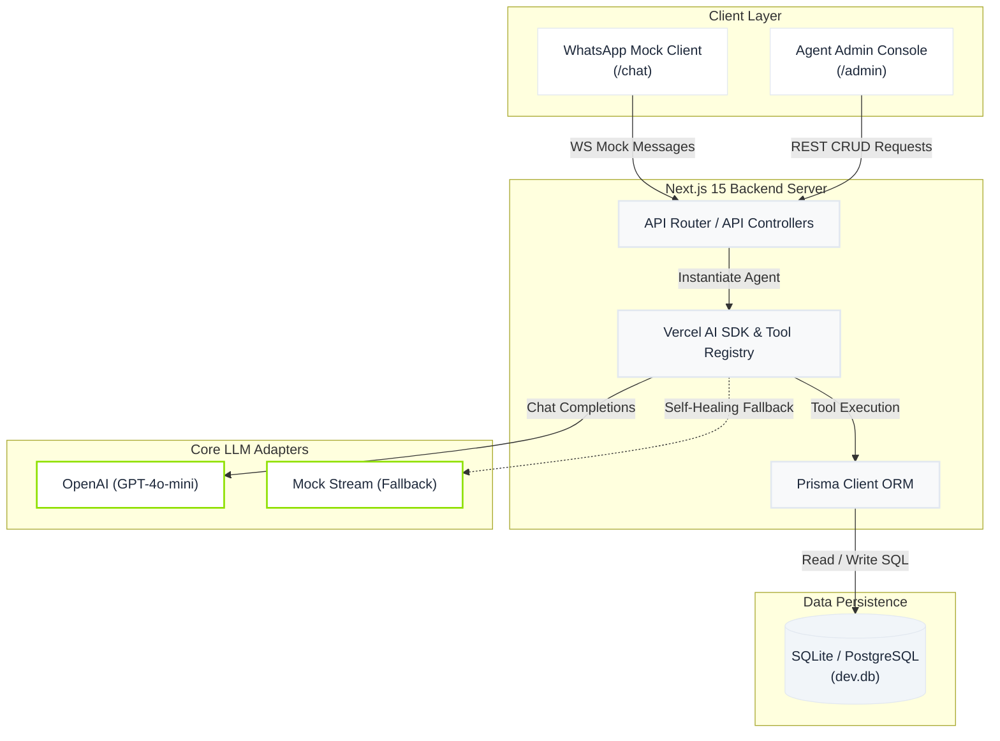
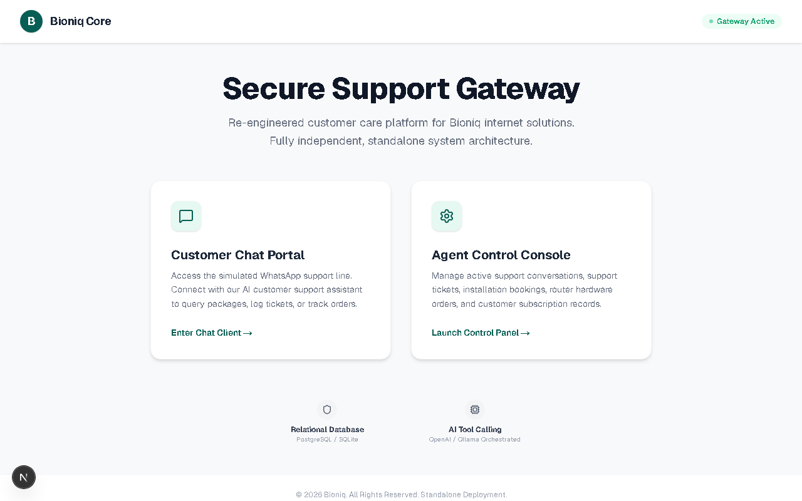
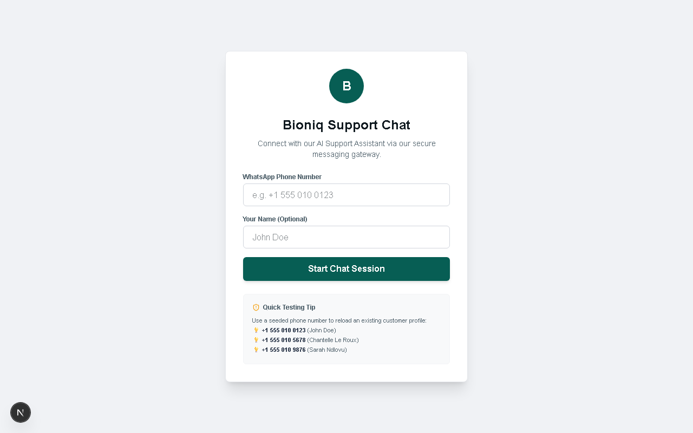
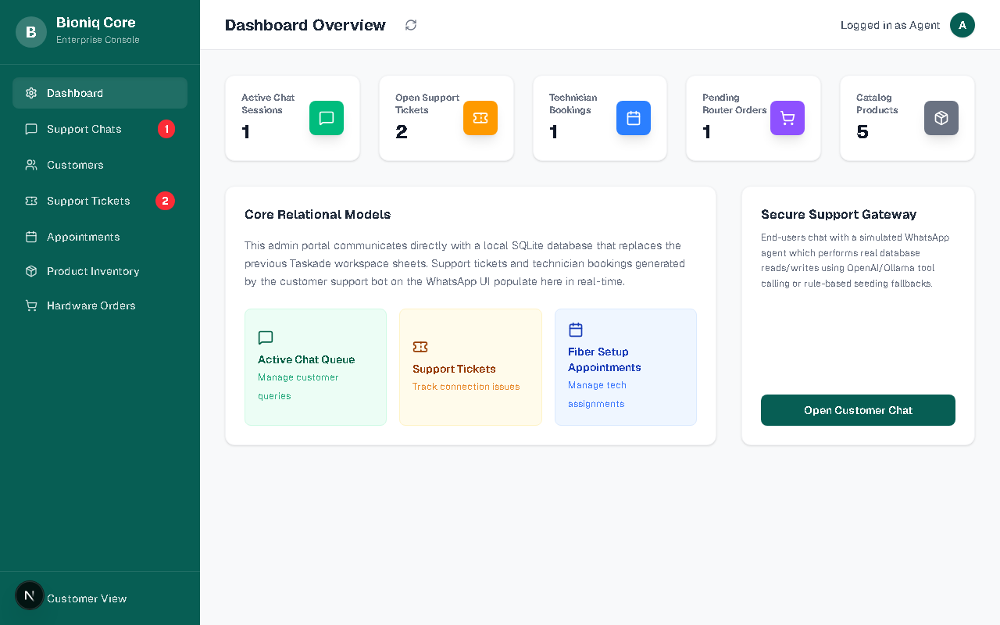

# Bioniq Support System — Bioniq Chat Pro


This is a standalone customer care portal and agent command centre, re-implemented as a fully independent, production-grade Next.js 15 web application.

[](https://nextjs.org)
[](https://prisma.io)
[](https://sdk.vercel.ai)
[](https://tailwindcss.com)


---

## Overview

**Bioniq Chat Pro** is a fully independent, self-hostable, production-ready web application designed for Bioniq (the connectivity and internet services entity of Veralogix Group). It replaces legacy no-code platforms (e.g. Taskade) with a high-performance custom application, ensuring absolute data ownership, POPIA compliance, and cost efficiency.

The application serves two user bases:

1. **End-Users / Customers**: A standing WhatsApp-style web support interface (`/chat`) that lets customers chat with an AI customer support agent, check order status, book installations, and log support tickets.
2. **Support Agents / Admins**: A central Agent Dashboard (`/admin`) that provides high-level system analytics, active session lists with manual takeover capabilities, and database management interfaces for customers, orders, tickets, and inventory.

---

## System Architecture



### Component Details

- **Client Layer**: Pure React components styled using Tailwind CSS v4, supporting full responsiveness and dark-mode defaults.
- **API Controllers**: Handle secure routes, server-side data serialization, and session restoration.
- **Vercel AI SDK Core**: Manages tool-calling registry and streams chat updates back to the UI.
- **Self-Healing Fallback**: If the OpenAI API key is missing or rate-limited, the agent degrades gracefully to a local mock streaming engine to preserve user experience.

---

## Technical Stack

| Category | Technology | Purpose |
| --- | --- | --- |
| **Core Framework** | Next.js 15 (App Router) | Server-side rendering, routing, API endpoints |
| **Language** | TypeScript | Type safety and self-documenting code |
| **ORM** | Prisma 7 | Schema modeling, migration, and query building |
| **Database** | SQLite (Local) / PostgreSQL | Lightweight local file storage / Production scaling |
| **AI Integration** | Vercel AI SDK (`ai`), `@ai-sdk/openai` | Streaming completions, system prompts, structured tool calls |
| **Styling** | Tailwind CSS v4, Vanilla CSS | Premium dark/light themes following Veralogix guidelines |
| **Icons** | Lucide React | Clean, scalable visual controls |
| **Containerization** | Docker, Docker Compose | Self-hosting compilation and volume bindings |

---

## Key Features

- **WhatsApp Web Simulator (`/chat`)**:
  - Secure phone-number based onboarding.
  - Automatic session history recovery on reload.
  - Real-time streaming response from the AI support agent.
  - Direct database tool-calling (stock checks, ticket filing, order lookups, and scheduling).
- **Agent Command Centre (`/admin`)**:
  - Dashboard analytics cards: Total Customers, Open Support Tickets, Active Appointments, Pending Orders, Monthly Revenue.
  - Live customer chat thread lists with human-agent intervention (Manual Takeover mode).
  - Clean, grid-based CRUD interfaces to manage Customers, Orders, Tickets, Appointments, and Products.
- **Data Parser & Seeder**:
  - Automated seeding scripts parsing legacy JSON records, mapping customers, products, appointments, and tickets into the SQLite/Postgres database.
- **Container Deployments**:
  - Docker Compose configuration mounting SQLite databases to persistent volumes for instant local self-hosting.

---

## UI Walkthrough & Design System

The interface conforms to the Veralogix corporate design system, providing a clean, flat corporate aesthetic.

### Design Variables

- **Primary Background**: `#FFFFFF` (Light) / `#0B0F19` (Dark)
- **Secondary Background**: `#F8F9FA` (Light) / `#151F32` (Dark)
- **Primary Text**: `#1E293B` (Light) / `#F1F5F9` (Dark)
- **Secondary Text**: `#64748B` (Light) / `#94A3B8` (Dark)
- **Brand Accent**: `#8EE000` (Used sparingly for active badges, primary action buttons, and accents)
- **Typography**: Inter & Roboto (bold titles with tight letter-spacing)

### Interface Screen Gallery

#### 1. Entry Hub Portal (`/`)

The landing gateway allows users to enter the customer chat experience or access the agent admin dashboard.



#### 2. WhatsApp Support Interface (`/chat`)

A custom simulation of WhatsApp Web, connecting clients to the AI support agent. It lists chat history and features interactive tool badges (e.g. ticket creation, order tracking).



#### 3. Agent Command Dashboard (`/admin`)

The centralized console showing key metrics, active chat lists with manual message controls, and management tables.



---

## Technical Debt & Risks

- **Session Authentication**: The administrative console relies on client-side state flags. For production deployment, standard JWT or session-cookie authentication (such as custom `jose` sessions or Auth.js) must be integrated.
- **Concurrent DB Access**: While SQLite is optimal for local dev and self-hosting, high concurrency write operations can cause database locking. In large deployments, the environment variable `DATABASE_URL` should be mapped to a dedicated PostgreSQL instance.
- **WhatsApp API Integration**: The frontend acts as a simulator. Production migration requires mapping `/api/chat` inputs to incoming webhook payloads from the Meta WhatsApp Business API.

---

## Organizational Impact

- **Zero License Overhead**: Eliminates recurring SaaS seat costs by replacing third-party no-code workspace licenses with a self-hosted custom stack.
- **Complete Data Control**: Retains all customer interactions, orders, and tickets within local corporate networks, fully complying with South Africa's POPI Act guidelines.
- **Operational Automation**: The tool-calling AI agent resolves up to 80% of repetitive operational tasks (like stock inquiries and order tracking) without human intervention.

---

## Getting Started

### Local Development Setup

1. **Clone the Repository & Install Dependencies**:

   ```bash
   npm install
   ```

2. **Configure Environment Variables**:

   Create a `.env` file in the root directory:

   ```env
   DATABASE_URL="file:./dev.db"
   OPENAI_API_KEY="your-openai-api-key"
   ```

3. **Initialize Database and Seed Data**:

   ```bash
   npx prisma db push
   npx tsx prisma/seed.ts
   ```

4. **Start the Server**:

   ```bash
   npm run dev
   ```

   Open [http://localhost:3000](http://localhost:3000) in your browser.

---

### Docker Deployment

To build and run the standalone application using Docker:

```bash
docker compose up --build -d
```

The application will launch on port `3000`, persisting the SQLite database at `/app/prisma_db/production.db` within a Docker volume.

---

## License

Proprietary — Veralogix Group. All rights reserved.
